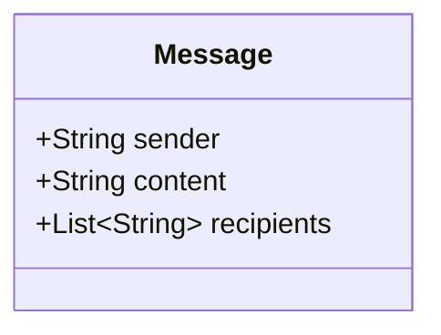
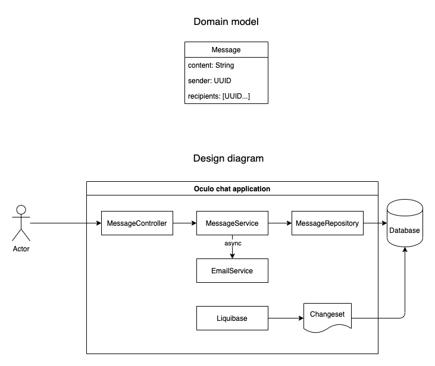

# Oculo chat application

## Design thoughts

### Domain thinking

Chat is a conversation between people, it essentially has a message shared between two parties. Person who send the message is sender and the person
who receive message is recipient. Domain model is message comprised of content, sender and recipient





### Strategy and development

I believe in TDD, and it helps me to design the system better. I tried to start creating small building block and separation of concern is followed by
assigning single responsibility to an object or function. The controller delegates the request to service which talk to `MessageRepository` to persist
the message and to send email by calling `EmailService`
Used liquibase to separate the database concern and to keep the setup seamless. I tried to keep code simple, so, I haven't implemented WebFlux to
allow asynchronous non-blocking chat. I haven't included any API contracts(swagger or pact). Still email service is an asynchronous call, the request
don't have wait for email processing.

## Pre-requisite

1. Docker
2. Java11
3. curl or postman

## Run the application

1. Clone the provided repo
2. Import the spring boot project to your IDE(Optional).
3. Application needs database, so database can be spin up in docker container
   `docker run --name oculo-chat -p 5432:5432 -e POSTGRES_PASSWORD=xKeye1RL9yIJf0BBwk40fQsGMjPzmmxtqyrLmZ94B8Sg4hoF8T -d postgres`
4. Run the project backend with IDE or `./gradlew bootrun`

### Test

`./gradlew test`
When it comes to TDD I always try to start with Unit, integration and build the way up to end-to-end test. Tried to keep the test independent of
environment, so used TestContainers which spin-up database(postgres) container for end-2-end-test to bridge the gap between real DB I have initiated
database with bare minimum data for both development and testing, this won't impact prod as I maintained two profiles dev and test

#### Send message

Json input(default)

`curl -XPOST -H "Content-Type: application/json" -d '{"sender": "8d1208fc-f401-496c-9cb8-483fef121234", "recipients": ["e6b920b7-4ac4-4b62-aea7-36f75e3ad610"], "content": "Hey"}' localhost:8080/api/messages`

Xml input

```
curl --location --request POST 'http://localhost:8080/api/messages' \
--header 'Content-Type: application/xml' \
--header 'Accept: application/xml' \
--data-raw '<MessageDto>
<content>ok</content>
<sender>8d1208fc-f401-496c-9cb8-483fef121234</sender>
<recipients>
<String>e6b920b7-4ac4-4b62-aea7-36f75e3ad610</String>
</recipients>
</MessageDto>'
```

#### Receive message

Json output(Default)

`curl -XGET localhost:8080/api/messages/senders/8d1208fc-f401-496c-9cb8-483fef121234/recipients/e6b920b7-4ac4-4b62-aea7-36f75e3ad610`

Xml output

`curl -XGET -H "Content-Type: application/json" -H "Accept: application/xml" localhost:8080/api/messages/senders/8d1208fc-f401-496c-9cb8-483fef121234/recipients/e6b920b7-4ac4-4b62-aea7-36f75e3ad610`